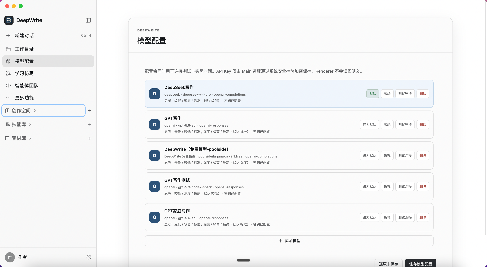
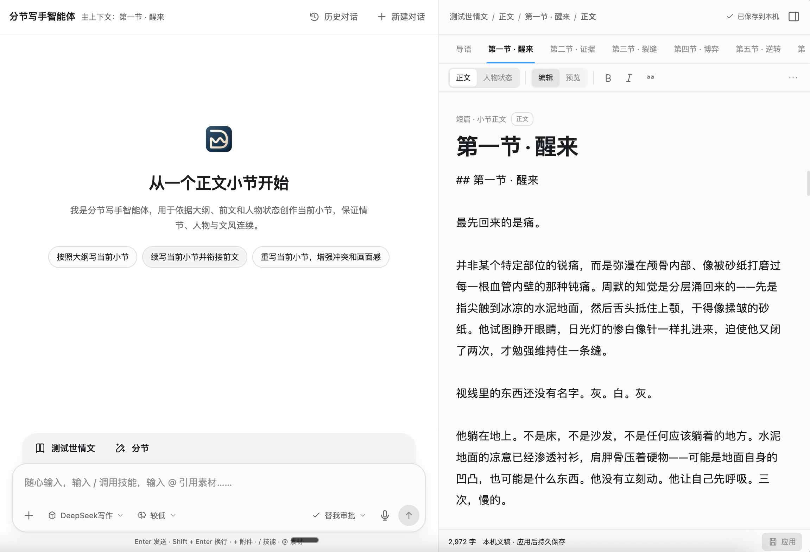
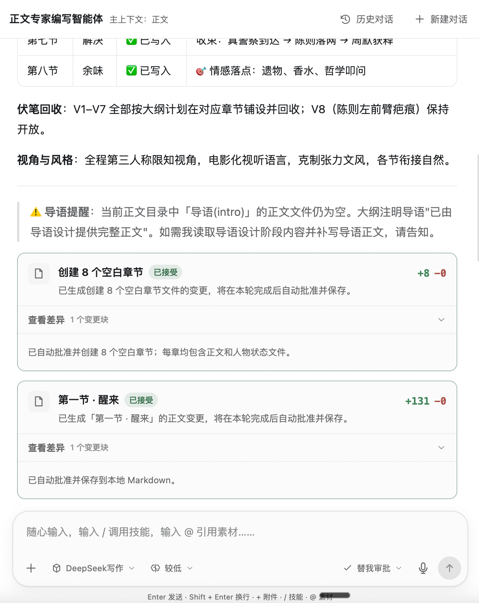
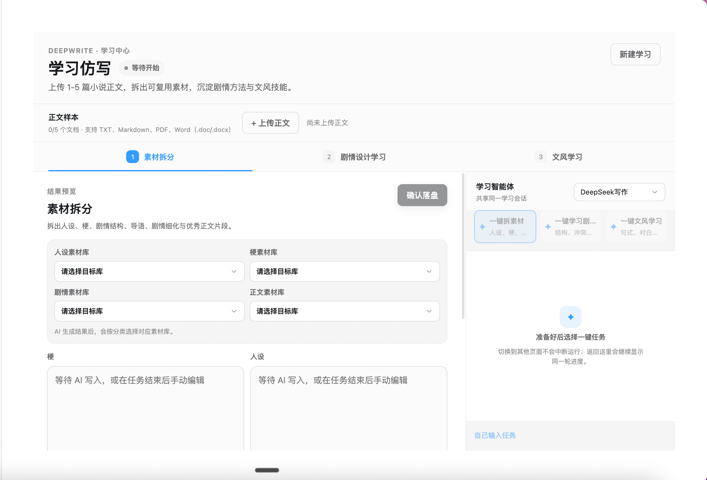

# DeepWrite

[English](./README.en.md) | [中文](./README.md)

> A local writing Harness Agent built for creators.

DeepWrite is not a simple AI chat window. It is an agent workbench designed for long-form writing workflows. It brings models, prompts, writing skills, materials, manuscripts, and tools together in one desktop app, so the AI can understand your current work, call the right capabilities, edit real documents, and hand every change to you for review.

The interface follows a Codex-style workflow: manage projects and context on the left, collaborate with agents in the middle, and read or edit real content on the right. Agents can help with character design, plot development, outline planning, section writing, and manuscript edits, while you keep full control over local files and the final text.

## Screenshots



## What DeepWrite Can Do

### A Codex-style writing workbench

DeepWrite uses a clear three-column layout that keeps the most common writing surfaces in one view:

- Left: works, chapters, material libraries, skill libraries, and common actions
- Middle: agent chat, reasoning, tool execution, and edit suggestions
- Right: characters, plots, outlines, manuscripts, materials, or skill content

When you switch between writing stages or chapters, DeepWrite automatically switches the matching agent and context. Browsing materials and skills does not interrupt the current manuscript, and chapters can be opened quickly in separate tabs.



### Specialized agents for the writing process

DeepWrite provides role-specific agents for short-form creation:

- Character Agent: design characters, relationships, motivations, and character arcs
- Plot Agent: plan the main storyline, opening hooks, conflicts, turns, and endings
- Outline Agent: turn characters and plot into an executable section outline
- Manuscript Expert: oversee structure, review drafts, and polish the final text
- Section Writer: write around the current chapter while keeping plot, characters, and voice consistent

Each agent can have its own system prompt, welcome shortcuts, model, and material access scope. Long-form stages always share full access to settings, plot, draft, and continuity content, while their readable material and skill types remain configurable per agent. You can also assemble sub-agent teams under a main agent so complex tasks can be handled by different roles together.

### Reviewable manuscript edits

Agents never silently overwrite your text. Writes first produce a clear diff so you can inspect additions and deletions, then accept or reject them. Only accepted changes are saved to the local project. If the manuscript has already been updated by another operation, DeepWrite keeps the newer version and avoids silent overwrites.



### Local-first works and knowledge bases

Works, chapters, materials, and skills are stored as `deepwrite.json` and UTF-8 Markdown files in local folders. They are not locked inside a proprietary format. You can version them with Git, sync them with cloud drives, or continue editing them in other text tools.

DeepWrite supports:

- Creating or opening local works
- Managing characters, plots, outlines, and multiple manuscript sections
- Creating material and skill libraries, and maintaining Markdown entries
- Binding specific material libraries, skill libraries, or resource groups to a work
- Importing legacy book ZIP archives into the current folder structure
- Automatically restoring unsaved drafts and recent agent sessions

### Bring your own models

You can add your own API services in model settings. Currently supported:

- OpenAI Completions
- OpenAI Responses
- Anthropic Messages
- Google Generative AI

Model keys are never exposed to the renderer. Different models can have default thinking levels, and you can switch models per task during a conversation.

### Style learning and imitation

With style learning, DeepWrite can analyze reference text in stages, extract reusable writing traits, and apply those results to later creation. Related models and prompts can be configured separately in settings.



## Installation

### Using installers

Download the installer that matches your OS and CPU from [GitHub Releases](https://github.com/swjybky/deepwrite/releases):

| Platform | Installer |
| --- | --- |
| Windows x64 | `DeepWrite-<version>-win-x64-test.exe` |
| macOS Apple Silicon | `DeepWrite-<version>-mac-arm64-test.dmg` |
| macOS Intel | `DeepWrite-<version>-mac-x64-test.dmg` |

On Windows, run the `.exe` and follow the installer.

On macOS, open the `.dmg` and drag DeepWrite into Applications. Current test builds use ad-hoc signing and are not notarized by Apple. After downloading via a browser, WeChat, or similar channels, macOS may show a security warning. Confirm the file source is trusted, then right-click the app and choose Open, or allow it in System Settings → Privacy & Security.

After the first launch, we recommend:

1. Choose a local workspace directory.
2. Add an API service in Model Settings and test the connection.
3. Create a new work, or open an existing DeepWrite project folder.
4. Create and bind material or skill libraries as needed.

### Run from source

Development requirements:

- Node.js 24 or later
- pnpm 11 or later
- Windows x64, or macOS Apple Silicon / Intel

```bash
git clone https://github.com/swjybky/deepwrite.git
cd deepwrite
pnpm install
pnpm dev
```

Build the production version:

```bash
pnpm build
```

Run the full verification suite:

```bash
pnpm verify
```

## Build test installers

Test installers must be built on the matching platform from the repository root:

```bash
# All currently supported test packages
pnpm pack:test

# Windows x64
pnpm pack:test:win

# macOS Apple Silicon
pnpm pack:test:mac:arm64

# macOS Intel
pnpm pack:test:mac:x64

# Both macOS architectures
pnpm pack:test:mac
```

Artifacts are written to `apps/desktop/release/`. The packaging flow runs type checks, boundary checks, tests, and a production build before generating and verifying installers.

## Project structure

```text
deepwrite/
├── apps/desktop/              # Electron desktop client
├── packages/contracts/        # Cross-process command and event contracts
├── packages/pi-runtime-adapter/
│                              # Agent Runtime adapter
├── packages/shared/           # Shared types and utilities
├── tools/                     # Verification, runtime, and packaging scripts
└── docs/                      # Architecture and phase docs
```

DeepWrite uses a multi-process Electron architecture. The Renderer handles UI only, Main manages windows and secure IPC, the Core Utility handles local project I/O, the Agent Utility runs models and agents, and the Tool Utility provides a bounded surface for controlled tool execution.

For more technical details, see:

- [Architecture](docs/ARCHITECTURE.md)
- [Phase status](docs/PHASE_STATUS.md)

## License

This project is licensed under the terms declared in [LICENSE](LICENSE).
