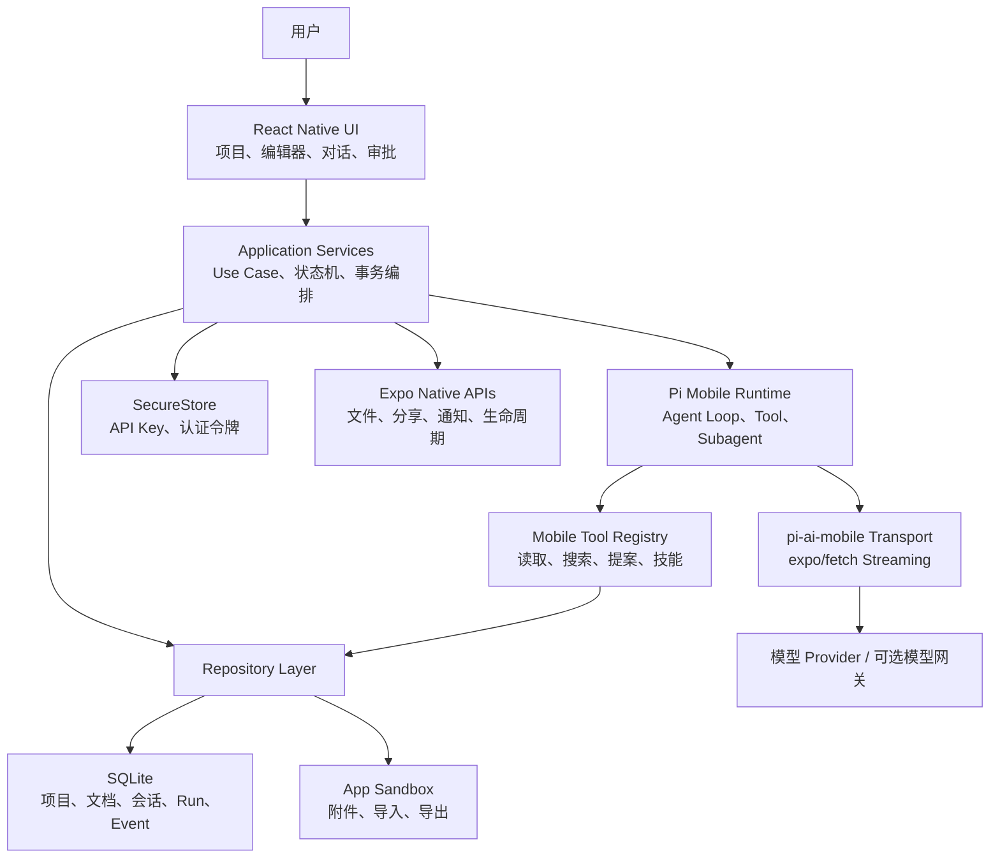
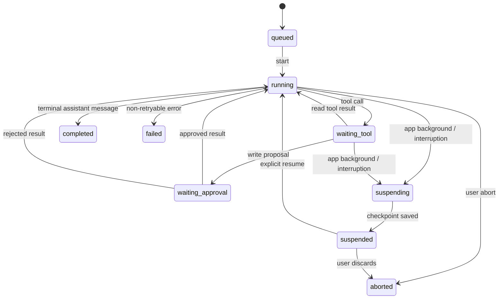

# DeepWrite 移动端 Pi 本地运行技术方案

> 文档日期：2026-08-09
>
> 文档状态：目标架构方案，尚未实施
>
> 适用范围：面向 iOS、Android 的全新移动端实现；不要求复用现有 Vue/Electron UI 代码
>
> 核心决策：React Native + Expo Development Build；Pi Agent Loop、工具调用与会话状态在手机本地运行；模型推理默认调用远程 Provider

## 1. 文档目标

本文定义 DeepWrite 移动端从零开发时的完整技术方案，重点解决：

- 如何让 Pi Agent Framework 真正在手机端运行，而不是放到业务服务器；
- 如何把 Pi 中可跨平台的 Agent Loop 与 Node.js 专属能力分离；
- 如何在 React Native / Hermes 中实现模型流式调用、工具调用、Subagent 和会话恢复；
- 如何处理移动端文件系统、SQLite、密钥、后台限制、资源预算和 App Store 规则；
- 如何把 DeepWrite 的写作、资料、技能、Agent 修改审批等能力重新设计为移动端架构；
- 如何通过可验证的阶段性计划降低一次性重写风险。

本文是目标蓝图，不描述当前桌面端已经实现的运行边界。桌面端现状仍以 `docs/ARCHITECTURE.md` 和 `docs/系统架构与智能体工具运行机制.md` 为准。

## 2. 核心结论

### 2.1 推荐方案

移动端采用以下组合：

| 层级 | 技术选择 |
|---|---|
| UI 框架 | React Native |
| 应用框架 | Expo Development Build，不以 Expo Go 作为正式运行环境 |
| 开发语言 | TypeScript，开启严格模式 |
| JavaScript 引擎 | Hermes |
| 导航 | Expo Router |
| 本地数据库 | `expo-sqlite` + 自有 Repository / Migration 层 |
| 安全密钥 | `expo-secure-store` |
| 应用文件 | `expo-file-system` |
| 文件选择 | `expo-document-picker` |
| 文件分享 | `expo-sharing` |
| 流式网络 | `expo/fetch` + `ReadableStream` |
| 本地 AI 框架 | 精简后的 `pi-agent-core` Mobile Entry |
| Provider 层 | DeepWrite 自有 `pi-ai-mobile` StreamFn 实现 |
| Schema | TypeBox，与 Pi 工具参数保持同一类型体系 |
| 应用状态 | Zustand，仅管理界面和短生命周期状态 |
| 持久状态 | SQLite 是项目、会话、Agent Run 和审批状态的唯一真源 |
| 动画与手势 | Reanimated + Gesture Handler |
| 构建发布 | Expo Prebuild / EAS Build 或原生 Xcode、Gradle 流程 |

### 2.2 “Pi 在手机端运行”的准确含义

本方案中的本地运行包括：

- Pi `Agent` 和 Agent Loop 在手机 Hermes 中执行；
- Prompt 组装、消息历史、上下文裁剪在手机本地执行；
- Tool Calling 的解析、验证、调度、审批和结果回填在手机本地执行；
- Subagent 的创建、状态管理和工具调用在手机本地执行；
- 项目读取、搜索、正文变更提案和持久化在手机本地执行；
- 会话、运行事件和工具幂等记录在手机 SQLite 中持久化。

默认不包括：

- 在手机 CPU/GPU 上运行大语言模型权重；
- 在 iOS 后台无限期持续运行 Agent；
- Shell、任意子进程或任意系统目录访问；
- 原封不动嵌入桌面版完整 Node.js Pi Runtime。

模型推理默认仍通过 OpenAI、Anthropic、Google 或 OpenAI-compatible API 完成。未来如接入本地小模型，只替换 `StreamFn`，不改变 Pi Agent Loop 和工具架构。

## 3. 设计原则

1. **Pi 本地，模型可远程。** Agent 决策、工具和数据留在设备上；模型 Provider 是可替换计算端。
2. **SQLite 是持久真源。** Zustand 不保存需要跨启动恢复的业务状态。
3. **写操作先提案后提交。** Agent 不直接覆盖用户正文。
4. **所有工具最小授权。** 不提供 Shell、任意路径和任意代码执行。
5. **每个副作用可幂等恢复。** App 被系统终止后，已完成工具不能重复执行。
6. **默认服从最弱平台。** 跨平台产品语义以 iOS 后台限制为基线，Android 增强能力单独标注。
7. **移动优先重构信息架构。** 不把桌面三栏界面按比例压缩到手机。
8. **Provider 按需装配。** 禁止在移动包中导入 Pi 的全量 Provider Catalog。
9. **协议先于实现。** Agent 事件、工具参数、持久状态和错误码必须先定义 Schema。
10. **先完成真机可行性门禁。** 未通过 iOS/Android 真机 Spike 前，不进入全功能开发。

## 4. 范围与非目标

### 4.1 第一版范围

- iOS、Android 双平台；
- 短篇、剧本、长篇项目的移动化基础数据模型；
- 章节/小节级纯文本编辑；
- 自动保存、草稿恢复、版本历史；
- Pi 单 Agent、多轮对话和工具调用；
- 写作工具的提案、Diff、接受和拒绝；
- Skills 文本加载；
- 有限并发的 Subagent；
- OpenAI Completions-compatible、OpenAI Responses、Anthropic Messages；
- BYOK 密钥模式；
- 项目导入、导出和系统分享；
- 前后台切换后的安全恢复。

### 4.2 第一版非目标

- Word 级富文本排版；
- 任意 Shell、插件二进制和动态 JavaScript 工具；
- iOS 锁屏后持续数小时运行 Agent；
- 手机端训练、微调或运行大型本地模型；
- 多人实时协同编辑；
- 无冲突的跨设备实时同步；
- 桌面端全部 UI 与功能逐像素复刻；
- 一开始支持 Pi 内置的所有 Provider、OAuth 和代理模式。

## 5. 总体架构



### 5.1 依赖方向

```text
UI
  → Application
    → Domain
    → Runtime Ports
    → Repository Ports

Infrastructure
  → 实现 Runtime Ports、Repository Ports、Platform Ports
```

领域层不得直接依赖：

- React Native；
- Expo；
- SQLite 驱动；
- Pi Provider SDK；
- iOS/Android 原生 API。

这样可以用普通 Node/Vitest 环境测试绝大多数 Agent 状态机、审批、版本冲突和恢复逻辑。

## 6. 建议工程结构

如果继续使用当前 monorepo，建议新增移动应用和移动专用包，不直接修改桌面 Renderer：

```text
apps/
  desktop/                         # 现有 Electron 应用
  mobile/                          # React Native + Expo
    app/                            # Expo Router 页面
    src/
      features/
      components/
      application/
      infrastructure/
      platform/
      theme/

packages/
  mobile-contracts/                # 移动端命令、事件、Schema
  mobile-domain/                   # 项目、文档、会话、审批领域模型
  pi-agent-mobile/                 # Pi Mobile Entry / Fork 封装
  pi-ai-mobile/                    # Provider StreamFn
  mobile-agent-runtime/            # Pi 与 DeepWrite 领域适配
  mobile-agent-tools/              # 手机工具注册表
  mobile-storage/                  # SQLite Schema、Migration、Repository
  mobile-import-export/            # 项目包导入导出
  prompts/                         # 系统提示词和版本元数据
```

如果完全建立新仓库，也应保持同样的包边界。`pi-agent-mobile` 和 `pi-ai-mobile` 必须与 UI 解耦，以便单独发布、测试和升级。

## 7. Pi Mobile 兼容性分析

### 7.1 当前可复用的能力边界

现有项目使用：

```text
@earendil-works/pi-agent-core 0.80.3
@earendil-works/pi-ai         0.80.3
```

当前 Pi Adapter 已经证明以下抽象可以保留：

- `Agent`；
- `AgentEvent`、`AgentMessage`、`AgentTool`；
- `StreamFn`；
- Tool 参数 Schema；
- Thinking、正文和 Tool Call 流式事件；
- Tool 执行前后 Hook；
- Sequential Tool Execution；
- Subagent；
- Provider Model 抽象。

Pi 包当前声明 `node >= 22.19.0`，不能把标准 npm 入口视为官方支持的 React Native 包。但源码分析表明，核心 Agent Loop 主要依赖 JavaScript、Pi 类型和事件流；Node 专属能力集中在 Harness Node Environment、CLI、进程、文件系统和部分 Provider。

### 7.2 移动端禁止直接导入的内容

- `@earendil-works/pi-agent-core/node`；
- Node Harness Environment；
- CLI；
- `node:child_process`、`node:fs`、`node:path`、`node:os`；
- Pi 的全量 `providers/all`；
- Bedrock Node HTTP Handler 和 Proxy Agent；
- Shell Tool；
- 依赖任意磁盘路径扫描的 Skill Loader；
- `NodeJS.Timeout` 和 `.unref()`；
- 依赖 `process.env` 的密钥解析。

### 7.3 Mobile Entry

建议维护 DeepWrite 的 Pi Fork，并向上游提交可选的 Mobile Entry。入口只导出移动安全能力：

```ts
// packages/pi-agent-mobile/src/mobile.ts
export { Agent } from "./agent";
export {
  agentLoop,
  agentLoopContinue,
  runAgentLoop,
  runAgentLoopContinue
} from "./agent-loop";

export type {
  AgentEvent,
  AgentMessage,
  AgentTool,
  AgentToolResult,
  StreamFn
} from "./types";
```

包导出：

```json
{
  "exports": {
    ".": "./dist/index.js",
    "./mobile": "./dist/mobile.js"
  }
}
```

移动端只允许：

```ts
import { Agent } from "@deepwrite/pi-agent-mobile/mobile";
```

通过 ESLint/边界检查禁止 Mobile App 从 Pi 根入口、Node Entry 或 Provider All 导入。

## 8. `pi-ai-mobile` Provider 层

### 8.1 为什么独立实现

直接把 Pi 所有 Provider SDK 打入移动包会带来：

- Node 模块解析失败；
- 包体积膨胀；
- Metro 动态导入兼容风险；
- 不需要的 OAuth、Bedrock、Proxy 代码进入攻击面；
- Provider SDK 对 React Native Streaming Fetch 的实现差异。

因此移动端保留 Pi 的 `Model`、`Context`、`AssistantMessageEventStream` 等契约，但用 `expo/fetch` 实现少量经过真机验证的 Transport。

### 8.2 第一批 Provider

| Provider API | 第一版 | 实现方式 |
|---|---:|---|
| OpenAI Completions-compatible | 是 | 原始 HTTP + SSE/JSON Chunk Parser |
| OpenAI Responses | 是 | 原始 HTTP + Responses Event Parser |
| Anthropic Messages | 是 | 原始 HTTP + SSE Parser |
| Google Generative AI | 第二阶段 | 原始 HTTP + Provider Parser |
| Ollama | Android/LAN 实验 | OpenAI-compatible；必须提示局域网与明文 HTTP 风险 |
| AWS Bedrock | 否 | 需要额外签名和 Node/AWS 兼容工作 |
| GitHub Copilot OAuth | 否 | 审核授权和协议风险单独评估 |

### 8.3 StreamFn 接口

```ts
export interface MobileProviderRequest {
  model: Model;
  context: Context;
  apiKey?: string;
  signal?: AbortSignal;
  sessionId: string;
  thinkingLevel: ThinkingLevel;
  timeoutMs: number;
}

export type MobileProviderFactory = (
  request: MobileProviderRequest
) => Promise<AssistantMessageEventStream>;
```

Transport 必须统一输出：

- `start`；
- `text_start` / `text_delta` / `text_end`；
- `thinking_start` / `thinking_delta` / `thinking_end`；
- `toolcall_start` / `toolcall_delta` / `toolcall_end`；
- `done`；
- `error`。

### 8.4 网络规则

- 每次请求必须使用 `AbortController`；
- 连接超时、首包超时、空闲超时分别配置；
- Provider 429、5xx 和网络断开按幂等 Turn 策略重试；
- Tool 已经执行后不得通过整轮重试再次执行；
- 不自动重放用户可能计费的失败请求，除非错误明确属于安全重试类型；
- App 切入后台时保存最后一个已确认流事件序号；
- 流结束但缺少终态时转换为结构化错误；
- 日志中不得输出 Authorization、完整 Prompt 和正文。

## 9. Pi Runtime 状态机

### 9.1 Run 状态



### 9.2 关键规则

- 同一 Session 同时只能有一个 Root Run；
- 第一版全局最多运行一个 Root Agent；
- Subagent 默认并发上限为 1，验证稳定后最高放宽到 2；
- 所有工具默认串行执行，纯读取工具后续可显式标记安全并发；
- App 从后台恢复后不自动继续产生模型费用，必须由用户确认继续；
- Run 终态只能写入一次；
- `completed`、`failed`、`aborted` 之后拒绝迟到流事件；
- 每个 Run 使用单调递增 `sequence` 去重和恢复。

### 9.3 事件协议

```ts
export interface MobileAgentEvent<T = unknown> {
  id: string;
  sessionId: string;
  runId: string;
  sequence: number;
  type: MobileAgentEventType;
  createdAt: string;
  payload: T;
}
```

建议事件类型：

```text
agent.run_queued
agent.turn_started
agent.retry_scheduled
agent.text_delta
agent.thinking_delta
agent.tool_stream
agent.tool_requested
agent.tool_completed
agent.write_proposed
agent.write_approved
agent.write_rejected
subagent.started
subagent.progress
subagent.completed
agent.suspended
agent.resumed
agent.completed
agent.failed
agent.aborted
```

高频 Delta 只按 30–60 ms 批量刷新 UI；持久化可按时间和字节阈值合并，终态和工具事件必须立即落盘。

## 10. 本地工具体系

### 10.1 工具分类

| 分类 | 默认策略 | 示例 |
|---|---|---|
| 只读工具 | 自动执行 | 读取文档、搜索、列出人物、加载技能 |
| 变更提案工具 | 生成提案，等待用户确认 | 修改正文、更新设定、创建章节 |
| 导出/分享工具 | 需要显式用户操作 | 导出 Markdown、调用系统分享 |
| 网络工具 | 域名与请求能力受限 | 可选搜索、抓取公开资料 |
| 危险工具 | 不提供 | Shell、任意代码执行、任意路径删除 |

### 10.2 第一版工具集合

```text
get_workspace_index
read_document
search_workspace
read_active_editor
list_character_entries
read_character_entry
list_plot_entries
load_skill
propose_document_replace
propose_text_patch
propose_create_document
propose_update_character
propose_update_plot
spawn_subagent
```

### 10.3 工具执行边界

每个工具必须具备：

- TypeBox 参数 Schema；
- 参数最大长度和数组最大数量；
- 当前 Project、Session、Run、Agent Profile 授权；
- 超时；
- `toolCallId` 幂等记录；
- 结构化错误码；
- 不包含敏感正文的摘要日志；
- 可取消的异步实现；
- 单元测试和异常恢复测试。

工具不得接收未经验证的绝对路径。模型只能使用稳定资源 ID，由 Repository 把 ID 解析为 SQLite 行或 App Sandbox 文件。

### 10.4 写入审批

Agent 写工具只创建不可变 Proposal：

```ts
export interface DocumentMutationProposal {
  id: string;
  projectId: string;
  documentId: string;
  sessionId: string;
  runId: string;
  toolCallId: string;
  baseRevision: number;
  mutationType: "replace" | "patch" | "create";
  beforeTextHash: string;
  proposedText: string;
  status: "pending" | "accepted" | "rejected" | "conflict";
  createdAt: string;
}
```

接受时必须在同一 SQLite 事务内：

1. 读取当前文档 revision；
2. 比较 `baseRevision`；
3. revision 不同则标记 `conflict`；
4. 写入新正文和新 revision；
5. 写入文档历史；
6. 标记 Proposal accepted；
7. 写入 Tool Result；
8. 写入 Agent Event。

任何一步失败都回滚，不允许正文已改变但工具结果仍为 pending。

## 11. Skills 与 Subagent

### 11.1 Skills

移动端 Skill 是数据，不是可下载执行代码。Skill 由以下内容组成：

```ts
interface MobileSkill {
  id: string;
  name: string;
  description: string;
  instructions: string;
  version: number;
  source: "builtin" | "imported" | "user";
  enabled: boolean;
}
```

内置 Skill 随安装包发布；用户导入的 Markdown Skill 解析后进入 SQLite。引用资源复制到 App Sandbox，并通过资源 ID 读取。禁止 Skill 下载或注入 JavaScript、原生二进制和 Shell。

### 11.2 Subagent

- Subagent 与 Root Agent 共享同一 Hermes 运行时；
- 每个 Subagent 有独立 `subagentRunId`、消息上下文和 AbortSignal；
- 默认一次只运行一个 Subagent；
- 子 Agent 只能使用 Profile 明确允许的工具；
- 子 Agent 的写入仍只能产生 Proposal；
- 子 Agent 返回 Root Agent 的结果必须设置字符和 Token 上限；
- App 后台时 Root 与所有 Subagent 一起进入 suspended；
- 恢复时先检查未终结 Tool Call，再决定继续或补偿。

## 12. 本地数据架构

### 12.1 SQLite 表

| 表 | 作用 |
|---|---|
| `schema_migrations` | 数据库迁移版本 |
| `projects` | 项目元数据 |
| `documents` | 章节、设定、素材、技能正文 |
| `document_revisions` | 文档历史版本 |
| `project_relations` | 书籍、素材库、技能库绑定 |
| `skills` | Skill 元数据与正文 |
| `agent_profiles` | Agent 提示词、工具权限、模型偏好 |
| `sessions` | 会话身份、关联资源、状态 |
| `messages` | 用户、助手、Tool Result 消息 |
| `agent_runs` | 一次 Agent 运行和恢复检查点 |
| `agent_events` | 有序运行事件 |
| `tool_calls` | 工具幂等状态和结果 |
| `mutation_proposals` | 待审阅写入提案 |
| `attachments` | 附件元数据和 Sandbox URI |
| `model_configs` | 非敏感模型配置 |
| `app_settings` | 普通设置 |

### 12.2 关键字段与索引

- 所有业务主键使用 UUIDv7 或等价的时间有序 ID；
- `documents(project_id, kind, sort_order)` 建索引；
- `messages(session_id, sequence)` 唯一；
- `agent_events(run_id, sequence)` 唯一；
- `tool_calls(run_id, tool_call_id)` 唯一；
- `mutation_proposals(document_id, status)` 建索引；
- 正文另存 SHA-256，用于冲突和重复恢复判断；
- 时间统一存 ISO 8601 UTC；
- Schema Migration 只前进，不依赖卸载重装。

### 12.3 Repository 规则

- UI 不执行 SQL；
- Pi Tool 不执行 SQL；
- 只有 Repository 实现访问 SQLite；
- 多表修改必须由 Application Service 开事务；
- 查询返回领域 DTO，不暴露数据库行结构；
- 大正文按文档读取，不把整个项目一次性载入内存；
- 删除项目先进入软删除状态，确认后再清理附件文件。

## 13. 编辑器方案

### 13.1 第一版定位

第一版采用纯文本/Markdown 编辑器，不实现 Word 式富文本。编辑粒度为章节或小节，避免单个 `TextInput` 承载整部长篇。

### 13.2 编辑器要求

- 中文、日文等 IME Composition 不被自动保存或 Agent 回写打断；
- 输入状态保留在编辑器组件本地，不按每个字符刷新全局 Store；
- 500–1000 ms 空闲后写入 SQLite 草稿；
- 页面离开、App 切后台、系统内存警告时立即 flush；
- 正文、selection 和 scroll position 分开保存；
- Agent 写入期间不直接修改当前输入缓冲，而是产生 Proposal；
- 单文档建议软上限 50,000 字符，超限提示拆分章节；
- 搜索和替换在当前文档本地执行，全项目搜索走 SQLite FTS 或自建索引；
- 真机覆盖拼音九宫格、全键盘、语音输入、第三方输入法和外接键盘。

### 13.3 长文本性能

- 不把正文作为 Zustand 全局响应式字段；
- 不在每个 Delta 或按键时重建消息与正文全量数组；
- 会话列表和搜索结果使用虚拟列表；
- Diff 在后台分片计算并设置工作量上限；
- 超大 Diff 降级为分段摘要，仍允许查看完整新稿；
- 消息正文流按帧批量合并，避免逐 Token 重渲染。

## 14. 文件、导入与导出

### 14.1 文件边界

- 内部文件只存 App Sandbox；
- 用户通过系统 Document Picker 授权外部文件；
- 导入时将文件复制到临时区，完成类型、大小、编码和内容校验后再提交；
- Android `content://` URI 和 iOS 临时授权不得长期当作项目真源；
- 导出先生成 Sandbox 临时文件，再调用系统分享或保存；
- 文件名、扩展名和 MIME 必须同时校验；
- ZIP 解压限制文件数量、单文件大小、总大小、嵌套深度和路径穿越。

### 14.2 与桌面项目互通

由于手机无法像桌面端一样长期持有任意文件夹，建议定义版本化交换包：

```text
project.deepwrite.zip
  manifest.json
  documents/
  skills/
  materials/
  attachments/
```

交换包只用于显式导入/导出，不作为移动端实时项目目录。Manifest 必须含：

- formatVersion；
- projectId；
- exportId；
- exportedAt；
- 每个文件的相对路径、字节数和 SHA-256；
- 可选来源应用版本。

## 15. 密钥、安全与隐私

### 15.1 模型密钥模式

支持两种模式：

1. **BYOK 直连 Provider**
   - 用户自己输入 API Key；
   - Key 存入 SecureStore；
   - Pi 和请求都在手机端；
   - 不把 Key 写入 SQLite、日志、崩溃报告或剪贴板。

2. **DeepWrite 官方模型网关**
   - App 只保存短期用户令牌；
   - 网关只代理模型请求和计费，不运行 Agent；
   - Pi Agent Loop、Tools、Project Data 仍在手机本地；
   - 官方 Provider Key 永不下发到客户端。

不得把产品方统一 API Key 打进安装包。移动应用可以被逆向，任何内置长期密钥都应视为公开。

### 15.2 工具安全

- 每个 Agent Profile 使用显式工具 allowlist；
- 读取范围按 Project 和 Resource ID 限定；
- Tool Result 必须标注来源，不让外部文本伪装系统指令；
- 网络抓取内容视为不可信数据；
- Prompt Injection 不得扩大工具权限；
- 删除、覆盖和外发必须经过用户确认；
- 禁止动态下载并执行 JavaScript 工具；
- 禁止任意 URL 携带本地正文，网络工具使用域名和字段 allowlist；
- 日志默认只记录长度、哈希、状态和耗时。

### 15.3 数据保护

- SQLite 默认位于系统 App Container；
- 敏感设置单独放 SecureStore；
- 可选启用数据库字段级加密或 SQLCipher，但需先验证 Expo/RN 兼容性和性能；
- iOS 文件保护等级、Android Keystore 策略在原生配置中明确；
- 用户可导出、清除项目和删除全部模型密钥；
- 崩溃分析默认去除正文、Prompt、API Key、附件路径和模型响应。

## 16. 前后台、终止与恢复

### 16.1 平台事实

iOS 不允许普通写作应用在后台无限期持续执行网络 Agent。Android 可以通过 Foreground Service 获得更长运行时间，但会产生常驻通知、电量消耗和平台差异。

因此产品统一语义为：

- 前台运行时 Pi 正常流式工作；
- App 进入后台立即创建检查点；
- 在系统允许的短暂时间内完成正在提交的数据库事务；
- 流被中断后将 Run 标记为 suspended，而不是 failed；
- 回到前台展示“继续本次任务”按钮；
- 未经用户确认不自动产生新模型费用；
- 恢复时不重复执行已完成工具。

### 16.2 Checkpoint 内容

```ts
interface AgentCheckpoint {
  runId: string;
  sessionId: string;
  status: "suspended";
  lastEventSequence: number;
  lastMessageSequence: number;
  activeTurnId?: string;
  pendingToolCallIds: string[];
  completedToolCallIds: string[];
  pendingProposalIds: string[];
  modelConfigId: string;
  contextHash: string;
  suspendedAt: string;
}
```

### 16.3 恢复判定

| 中断点 | 恢复策略 |
|---|---|
| Provider 尚未返回任何内容 | 用户确认后重新发起 Turn |
| 已有部分文本，无 Tool Call | 保留部分文本；用户选择重试或结束 |
| Tool 参数流未完成 | 丢弃未完成 Tool Call，重新发起 Turn |
| Tool 已完成且结果已落盘 | 重建消息，不重复执行 Tool |
| 写提案待审批 | 恢复审批卡片 |
| 提案接受事务完成 | 根据 revision 和 tool record 收敛为 completed |
| 状态无法判定 | 标记 `needs_review`，不自动继续 |

## 17. 离线能力

无网络时仍支持：

- 打开和编辑项目；
- 搜索本地文档；
- 管理人物、剧情、章节、素材和 Skills；
- 自动保存和版本历史；
- 导入、导出；
- 查看历史会话与 Tool 轨迹。

远程模型不可用时：

- 不自动排队并在联网后调用，避免意外费用；
- 保存尚未发送的 Prompt Draft；
- 用户恢复网络后显式点击发送；
- Faux Provider 仅用于测试，不伪装成真实 AI。

未来接入本地模型时，新增 `LocalModelStreamFn`。本地模型能力应独立立项，评估模型大小、内存、Metal/NNAPI、量化、首 Token 延迟、电量和商店包体积。

## 18. 移动端信息架构

### 18.1 手机

建议底部四个一级入口：

```text
项目 | 写作 | AI | 我的
```

- 项目：书籍、资料库、技能库和最近文档；
- 写作：全屏章节编辑器；
- AI：当前资源关联的 Pi 会话、工具轨迹和审批；
- 我的：模型、密钥、外观、存储、导入导出。

资源树改为独立页面或抽屉；AI 对话可作为全屏页面或编辑器底部 Sheet。不得同时显示桌面三栏的完整内容。

### 18.2 平板

平板可使用双栏：

```text
资源/AI 辅助栏 | 编辑器
```

横屏宽度充足时允许三栏，但组件仍来自移动信息架构，不复用 Electron 窗口布局假设。

## 19. 资源预算与性能指标

### 19.1 默认预算

| 项目 | 第一版预算 |
|---|---:|
| Root Agent 并发 | 1 |
| Subagent 并发 | 1，最高实验值 2 |
| 单会话加载消息 | 最近 100 条，其余按需分页 |
| 单次 Tool Result 注入 | 建议不超过 20,000 字符 |
| 单文档编辑软上限 | 50,000 字符 |
| 单消息附件 | 最多 8 个 |
| 单次图片输入 | 按 Provider 和设备内存设置上限 |
| Delta UI 刷新 | 30–60 ms 批处理 |
| 自动保存 | 空闲 500–1000 ms |
| SQLite 写事务 | 目标小于 100 ms |

### 19.2 性能目标

- 冷启动到可编辑：中端设备目标小于 2.5 秒；
- 打开普通章节：目标小于 300 ms；
- 输入按键到界面反馈：P95 小于 50 ms；
- Agent Delta 到可见文本：P95 小于 150 ms，不含 Provider 网络延迟；
- 10,000 条文档索引搜索：目标小于 500 ms；
- 前后台切换保存检查点：目标小于 500 ms；
- Agent 运行时 UI 不出现持续掉帧。

## 20. 可观测性

本地结构化日志字段：

```text
timestamp
level
component
sessionIdHash
runId
eventType
provider
modelId
durationMs
inputLength
outputLength
toolName
errorCode
```

禁止记录：

- API Key、Authorization Header；
- 完整 Prompt、Thinking、模型正文；
- 用户完整文档；
- 外部文件绝对路径；
- SecureStore 内容。

调试导出包由用户显式生成，默认只包含脱敏日志、配置版本、数据库 Migration 版本、设备与应用版本。若用户选择附加内容，必须逐项说明并二次确认。

## 21. 测试策略

### 21.1 单元测试

- Agent Run 状态机；
- 事件去重与唯一终态；
- Tool 参数 Schema；
- Tool 授权；
- Revision 冲突；
- Proposal 接受事务；
- Context 裁剪；
- Provider Stream Parser；
- Session 重建；
- Import ZIP 安全校验。

### 21.2 集成测试

- Pi Agent + Faux StreamFn + SQLite；
- Tool Call → Tool Result → 下一 Turn；
- 写提案 → 接受/拒绝 → Agent 继续；
- Provider 流中断与重试；
- App 后台 Checkpoint 和前台恢复；
- SQLite Migration；
- 项目导入导出 Round Trip；
- SecureStore 保存、读取和删除。

### 21.3 真机矩阵

| 平台 | 最低覆盖 |
|---|---|
| iOS | 当前最低支持版本、当前最新版；至少一台低内存设备 |
| Android | 最低 API、主流 API、当前最新版；至少一个国产系统 |
| 输入法 | iOS 拼音、搜狗/微信输入法、Gboard、系统语音输入 |
| 网络 | Wi-Fi、蜂窝、弱网、断网、代理切换、网络恢复 |
| 生命周期 | 锁屏、切后台、来电打断、系统杀进程、设备重启 |
| 文件 | iCloud Drive、系统文件、Android SAF、超大 ZIP、异常编码 |

### 21.4 Provider 合约测试

每个 Provider 必须验证：

- 普通文本流；
- Thinking；
- Tool Call 参数分片；
- 多 Tool Call；
- Tool Result 后继续；
- 图片输入；
- 429；
- 5xx；
- 流中断；
- Abort；
- Usage；
- 模型不支持工具时的明确错误。

## 22. 构建、发布与审核

### 22.1 Expo 使用方式

- 正式工程使用 Expo Development Build；
- 允许 `expo prebuild` 生成可审计的 iOS/Android 工程；
- Expo Go 仅用于无自定义原生能力的早期 UI 验证；
- 依赖锁定并提交 Lockfile；
- 原生权限、Privacy Manifest 和 Android Manifest 变更进入代码评审；
- Pi Mobile Runtime 和工具实现随应用版本发布。

### 22.2 iOS 规则

- Pi JavaScript 和 Tool 实现必须包含在受审应用中；
- 不下载并执行会增加功能的 JavaScript Tool；
- Skill/Prompt 可以作为数据导入，但不能变成任意代码执行入口；
- 后台运行按 Apple 允许的任务类型设计，不伪装音频、定位或 VoIP；
- 文件只访问 App Container 或用户明确授权的资源；
- 模型请求、隐私政策和第三方数据处理必须如实披露。

### 22.3 发布门禁

- 所有单元、集成和真机关键路径通过；
- 无 Node Builtin 被打入 Mobile Bundle；
- 无产品方 API Key、测试密钥和用户正文进入包或 Source Map；
- iOS/Android Release 构建可安装；
- 断网、后台、杀进程恢复通过；
- 数据库从上一正式版本升级通过；
- 隐私清单和权限文案完成；
- TestFlight、Google Internal Testing 完成真实用户验证。

## 23. 分阶段实施计划

### Phase 0：Pi Mobile 可行性 Spike（强制门禁）

目标：证明 Pi 核心可以在 Hermes 真机运行。

交付：

- Expo Development Build 空应用；
- Pi Mobile Entry；
- Faux StreamFn；
- 一个只读工具和一个内存写工具；
- iOS、Android 真机 Agent 两轮 Tool Loop；
- Bundle 不含 Node Builtin 的自动检查。

通过标准：

- Metro Release Bundle 成功；
- Hermes 无 Node Polyfill 运行；
- Tool Call、Tool Result、下一 Turn 完整；
- Abort 生效；
- 100 次重复 Run 无明显内存持续增长；
- iOS、Android 都通过。

若失败：优先修复或 Fork Pi 核心；不直接转向 Node.js Mobile。

### Phase 1：Provider Streaming Spike

交付：

- `expo/fetch` 流式 Transport；
- OpenAI-compatible Provider；
- Anthropic Provider；
- Text、Thinking、Tool 参数 Delta；
- 超时、Abort、断网测试。

通过标准：

- 两个平台真机首包和持续流稳定；
- Tool 参数分片可还原；
- 中断后不产生重复 Tool；
- API Key 不出现在日志。

### Phase 2：移动应用基础与本地数据

交付：

- Expo Router 页面骨架；
- SQLite Schema/Migration；
- 项目、章节、素材、技能 CRUD；
- 编辑器、自动保存、草稿恢复；
- SecureStore 模型配置；
- 项目包导入导出。

### Phase 3：DeepWrite Pi Runtime

交付：

- Agent Profile；
- Context Builder；
- Session、Message、Run、Event 持久化；
- 模型选择和思考等级；
- Agent 对话 UI；
- Checkpoint 与显式恢复。

### Phase 4：工具与写入审批

交付：

- Workspace 读取与搜索工具；
- Skill Loader；
- 文档修改 Proposal；
- Diff、接受、拒绝和 Conflict；
- Tool 幂等和崩溃恢复。

### Phase 5：Subagent 与复杂工作流

交付：

- Subagent Registry；
- 并发与资源预算；
- 子 Agent 进度；
- 子 Agent 写入审批；
- 长篇阶段编排和取消恢复。

### Phase 6：产品化与商店发布

交付：

- 平板布局；
- 性能优化；
- 脱敏诊断；
- 权限与隐私文案；
- TestFlight / Google 内测；
- 商店审核材料；
- 数据迁移和升级演练。

## 24. 风险清单

| 风险 | 概率 | 影响 | 应对 |
|---|---:|---:|---|
| Pi npm 包的 Node Engine 与 Metro 不兼容 | 高 | 高 | 独立 Mobile Entry、Fork、Bundle 门禁 |
| Provider SDK 在 Hermes 流式异常 | 高 | 高 | 自有 `expo/fetch` Transport，不直接依赖全量 SDK |
| iOS 后台中断长任务 | 高 | 高 | Checkpoint、suspended、显式恢复，不承诺无限后台 |
| 中文长文本输入性能 | 中 | 高 | 章节拆分、本地输入缓冲、真机输入法专项测试 |
| Agent 重试导致工具重复 | 中 | 高 | `runId + toolCallId` 唯一索引和事务幂等 |
| BYOK Key 被逆向或日志泄漏 | 中 | 高 | SecureStore、禁止内置 Key、日志脱敏、网关模式 |
| 全量 Provider 导致包体积和构建失败 | 高 | 中 | Provider allowlist、按需模块、Bundle 分析 |
| Subagent 导致内存和电量过高 | 中 | 中 | 默认并发 1、上下文上限、生命周期取消 |
| 项目导入包攻击 | 中 | 高 | ZIP Bomb、路径穿越、大小、哈希和 Schema 校验 |
| App Store 对动态代码能力产生疑问 | 中 | 高 | 不下载执行代码；Tools 随包发布；审核说明透明 |
| 数据库升级损坏用户项目 | 低 | 高 | 前向 Migration、升级前备份、Round Trip 测试 |
| 移动端与桌面格式漂移 | 中 | 中 | 版本化交换包和 Compatibility Test Fixtures |

## 25. 验收标准

移动端第一版只有同时满足以下条件才算完成：

1. Pi Agent Loop 在 iOS、Android Hermes 真机运行；
2. 不依赖嵌入式 Node.js，不使用 Shell 和子进程；
3. 至少两个真实 Provider 支持 Text、Thinking 和 Tool Call 流；
4. 用户项目、会话、Run、Tool 和 Proposal 可跨启动恢复；
5. 已完成工具在断网、切后台、杀进程后不会重复执行；
6. Agent 写入必须经过审批和 revision 冲突校验；
7. 中文输入、自动保存和长文本滚动达到性能目标；
8. API Key 仅进入 SecureStore，不进入数据库和日志；
9. 离线时编辑、搜索、历史和导入导出可用；
10. iOS 后台限制在产品文案和运行状态中如实体现；
11. 项目交换包可在移动端完整导入导出；
12. Release 构建、数据库升级、隐私清单和商店内测全部通过。

## 26. 默认决策与待确认项

在没有进一步产品决策时，采用以下默认值：

| 项目 | 默认决策 |
|---|---|
| Pi 运行位置 | 手机 Hermes 本地 |
| 模型推理 | 远程 Provider |
| 密钥模式 | BYOK；官方模型使用薄网关 |
| UI 技术 | React Native + Expo Development Build |
| 编辑格式 | 纯文本/Markdown |
| 本地真源 | SQLite |
| 工具执行 | 默认串行 |
| Root Agent 并发 | 1 |
| Subagent 并发 | 1 |
| 写操作 | 必须提案审批 |
| 后台策略 | 保存并暂停，前台显式恢复 |
| 动态工具代码 | 禁止 |
| 桌面互通 | 版本化 ZIP 交换包 |

后续需要产品明确的事项：

- iOS、Android 最低系统版本；
- 是否首发即支持平板；
- 是否提供 DeepWrite 官方模型网关；
- 是否需要跨设备云同步；
- 是否把本地小模型列入首发；
- 移动端与桌面端是否必须双向保持全部项目字段；
- 哪些桌面 Agent/Tool 属于移动首发必备功能。

## 27. 参考资料与源码基线

### 27.1 当前项目源码

- `packages/pi-runtime-adapter/package.json`：当前 Pi 包和版本；
- `packages/pi-runtime-adapter/src/index.ts`：当前 Provider、Agent Event、Tool、Subagent 和重试适配；
- `packages/pi-runtime-adapter/src/*-tools.ts`：现有 DeepWrite 工具语义参考；
- `packages/contracts/src/`：现有项目、会话、运行和工具契约参考；
- `apps/desktop/src/utilities/`：当前桌面文件存储、搜索和事务语义参考。

这些源码只作为业务语义和风险案例参考。移动端按本文边界重新实现，不复制 Electron IPC、Utility Process、Node 文件系统和桌面 UI。

### 27.2 外部资料

- React Native 官方建议新项目使用 Framework：<https://reactnative.dev/docs/environment-setup>
- Expo Framework：<https://docs.expo.dev/get-started/create-a-project/>
- Expo Streaming Fetch：<https://docs.expo.dev/versions/latest/sdk/expo/>
- Expo SQLite：<https://docs.expo.dev/versions/latest/sdk/sqlite/>
- Apple App Review Guidelines：<https://developer.apple.com/app-store/review/guidelines/>
- Apple Background Tasks：<https://developer.apple.com/documentation/BackgroundTasks/choosing-background-strategies-for-your-app>
- Node.js Mobile React Native 维护状态参考：<https://github.com/JaneaSystems/nodejs-mobile-react-native>

## 28. 最终建议

DeepWrite 移动端不应尝试复制 Electron 的 Node + Utility Process 架构，也不应把 Pi 移到业务服务器。正确路线是：

1. 保留 Pi 的 Agent Loop、消息、工具和 Subagent 抽象；
2. 建立明确的 `pi-agent-mobile` 入口；
3. 用 `expo/fetch` 实现 `pi-ai-mobile` Provider Transport；
4. 用 SQLite、SecureStore、FileSystem 实现移动平台能力；
5. 把所有写工具改为本地 Proposal + Revision Transaction；
6. 用 Checkpoint 和幂等工具记录适应移动生命周期；
7. 先通过 iOS、Android 真机可行性门禁，再开始完整产品重写。

这样可以同时满足“Pi 真正在手机端运行”“不依赖完整 Node”“保持移动端原生体验”和“可通过商店发布”的目标。
