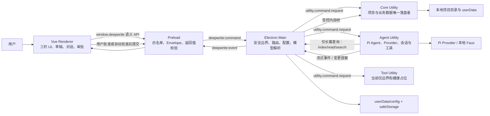
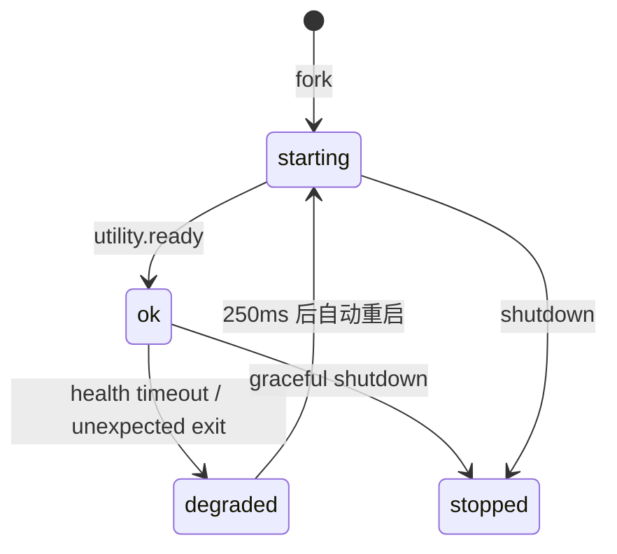
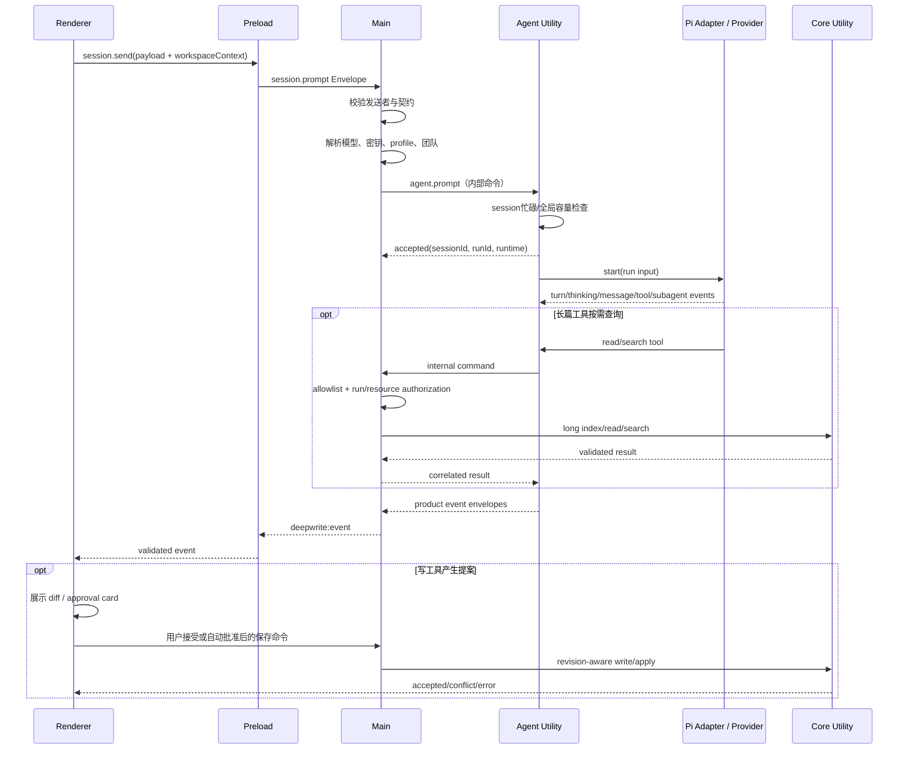
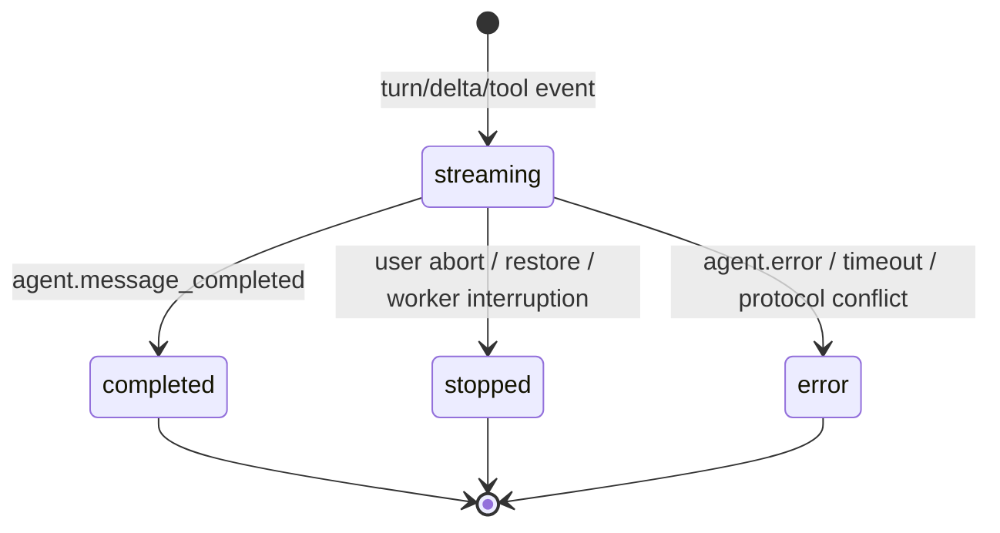
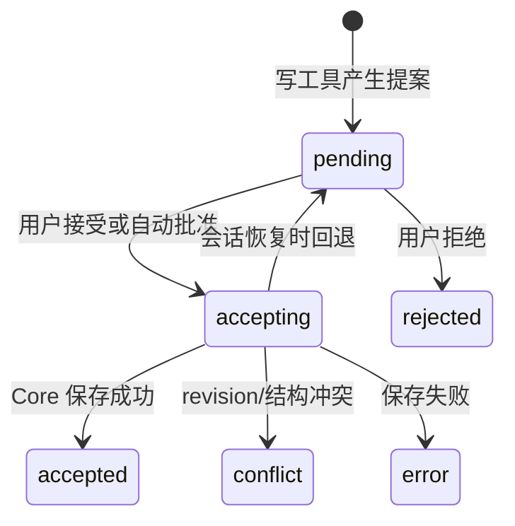

# DeepWrite 系统架构与智能体、工具运行机制

> 文档基线：2026-08-06 当前工作树（包含尚未提交的本地实现）
>
> 文档性质：现状架构说明，不是目标蓝图。凡“已实现”“当前”均以本文所列源码为准。

## 1. 文档目标

本文统一说明 DeepWrite 桌面客户端的：

- 整体模块、进程边界和依赖方向；
- Renderer、Preload、Main 与三个 Utility Process 的职责；
- 命令、事件、会话、运行、工具调用和审批状态；
- 智能体选择、提示词拼接、上下文注入、模型调用、重试和中止；
- 短篇、剧本、长篇、资料库、学习仿写和技能转子智能体的工具装配；
- 本地项目、配置、模型密钥和恢复数据的持久化边界；
- 当前实现与目标边界之间的差距。

本文不展开每个 Zod 字段和每个工具参数的逐字段 API 手册；契约真源位于 `packages/contracts/src/`，工具 schema 真源位于 `packages/pi-runtime-adapter/src/*-tools.ts`。

## 2. 架构总览



核心原则：

1. Renderer 不拥有 Node、文件系统、模型密钥或 Pi SDK 能力。
2. 所有跨边界数据先通过版本化 Envelope 和 Zod schema 校验。
3. Main 是信任汇聚点：验证发送者、打开系统选择器、解析模型密钥、选择智能体配置、监督子进程。
4. Core Utility 是创作项目和长篇项目的唯一磁盘写入者。
5. Agent 的写工具默认产生“变更提案”，不直接宣称保存成功；批准、冲突检查和持久化在客户端链路完成。
6. 长篇正文按需从 Core 查询，Agent 不能提交任意路径；Main 只放行绑定到已受理 run 的三个查询命令。

## 3. 仓库分层

| 路径 | 责任 | 关键入口 |
|---|---|---|
| `apps/desktop/src/renderer/` | Vue UI、工作区投影、编辑草稿、对话与审批状态 | `App.vue`、`composables/useAgentConversation.ts` |
| `apps/desktop/src/preload/` | 暴露最小语义 API，构造命令并校验结果/事件 | `index.ts` |
| `apps/desktop/src/main/` | Electron 生命周期、安全 IPC、配置存储、模型解析、Utility 监督与命令路由 | `index.ts`、`supervisor.ts` |
| `apps/desktop/src/utilities/` | Core/Agent/Tool 子进程入口及本地项目服务 | `core-entry.ts`、`agent-entry.ts`、`tool-entry.ts`、`runtime.ts` |
| `packages/contracts/` | 所有进程间命令、事件、状态和领域快照的 Zod 契约 | `system.ts`、`session.ts`、各领域文件 |
| `packages/pi-runtime-adapter/` | Pi 模型适配、提示词、会话复用、工具装配、重试、子智能体 | `index.ts`、`*-tools.ts`、`subagent-runtime.ts` |
| `packages/shared/` | ID、时间等无领域副作用的共享工具 | `src/index.ts` |
| `tools/` | 构建边界检查、Electron 恢复与测试包编排 | `check-renderer-boundary.mjs`、`run-test-package.mjs` |

依赖方向应保持为：Renderer → Preload API/Contracts；Main/Utilities → Contracts/Shared；Agent Utility → Pi Runtime Adapter。Renderer 不应直接依赖 Electron 主进程实现、Node 文件 API 或 Pi SDK。

## 4. 进程与安全边界

### 4.1 Renderer

Renderer 负责展示与交互，不是权威存储：

- 三栏工作台、资源树、右侧编辑器和设置页面；
- 将 Catalog/Long Workspace 快照投影为 UI；
- 保存未提交的内存草稿和恢复副本；
- 按工作区、作品、智能体和稳定节点 ID 隔离对话；
- 合并流式正文、思考、工具轨迹、子智能体轨迹和重试提示；
- 管理文本变更提案及 `pending → accepting → accepted/...` 状态；
- 用户接受或自动批准后调用语义化保存 API。

BrowserWindow 使用 `contextIsolation: true`、`nodeIntegration: false`、`sandbox: true` 和 `webSecurity: true`。Renderer 不能绕过 Preload 直接访问主进程能力。

### 4.2 Preload

Preload 通过 `contextBridge` 暴露 `window.deepwrite`，主要 API 域包括：

- `health`、`session`；
- `catalog`、`long`；
- `models`、模型用量；
- 短篇/剧本/长篇/资料库/学习仿写智能体设置和团队设置；
- 工作目录、外观、通用设置和文稿导出。

Preload 为每次调用生成命令 ID/correlation ID，构造 Envelope，经 `deepwrite:command` 请求 Main，并对 `CommandResult` 与业务 payload 再次校验。事件从 `deepwrite:event` 进入后同样按系统事件 schema 校验。

### 4.3 Electron Main

Main 同时承担应用协调者和安全策略执行者：

- 只接受当前活动 DeepWrite 窗口发来的 IPC；
- 拒绝 Renderer 直接调用 `agent.prompt`、`agent.abort`、`agent.model_test` 以及带可信绝对路径的内部命令；
- 将公开 `session.prompt` 转换为内部 `agent.prompt`；
- 解析默认/指定模型、思考等级、温度和加密 API Key；
- 按可信工作区快照选择实际智能体 profile 与子智能体定义；
- 打开系统目录/文件选择器，再构造带授权路径的 Core 命令；
- 维护活动 run 与用量上下文，广播 Agent/系统事件；
- 监督 Core、Agent、Tool Utility 的启动、健康、退出、重启和关闭。

### 4.4 Core Utility

Core 是本地创作数据唯一写入者，当前承载两套项目服务：

- 短篇/剧本/素材库/技能库的 Folder Catalog；
- 长篇项目的 Long Workspace Service。

它处理新建、打开、注册、复制、重命名、删除、导入、读取、搜索、revision 校验、操作预览、原子写入、章节提交和回滚。Main/Renderer 只拿到结构化结果，不直接持有任意文件写能力。

### 4.5 Agent Utility

Agent Utility 持有单例 `PiAgentRuntimeAdapter`，负责：

- 受理内部 `agent.prompt`、`agent.abort`、`agent.model_test`；
- 每个 session 最多一个活动 run；
- 全局最多 4 个并行活动流；
- 为每个 run 建立 `AbortController`；
- 将 Adapter 的异步事件流转换为产品事件 Envelope；
- 在关闭时中止全部 run，并最多等待活动流 1 秒收敛；
- 长篇工具需要数据时，经 Utility 内部命令桥请求 Core。

### 4.6 Tool Utility：当前真实状态

Tool Utility 已具备独立 Utility Process、ready、heartbeat、health、shutdown 和异常重启边界，但入口当前仅执行：

```ts
bootUtility("tool", { mode: "tool-boundary-only" });
```

因此，当前模型可见的短篇、长篇、资料库、学习仿写和子智能体工具都实际装配、执行在 Agent Utility 内。Tool Utility 尚未承担业务工具执行、策略审批或副作用隔离。架构讨论中应将它描述为“已建立的进程边界/待迁移执行面”，不能描述为“当前工具真实执行器”。

## 5. 协议与命令路由

### 5.1 Envelope 身份

命令和事件使用统一 Envelope，关键身份包括：

- `id`：命令或事件自身 ID；
- `correlationId`：一次外部请求与其事件流的关联 ID；
- `sessionId`：可复用的对话身份；
- `runId`：一次发送对应的运行身份；
- `resourceId`：绑定的活动作品/资源；
- payload 内的 `messageId`、`turnId`、`toolCallId`、`subagentRunId`。

契约会校验 Envelope 上的 session/run/resource 与 payload 或工作区快照一致，防止事件串线和资源替换。

### 5.2 路由矩阵

| 命令类别 | 公开入口 | Main 处理 | 最终执行者 |
|---|---|---|---|
| `system.health` | Renderer | 聚合三个 Worker 健康 | Main/Supervisor |
| Catalog/Long 普通业务命令 | Renderer | 安全检查、必要时系统选择器、内部命令转换 | Core Utility |
| `session.prompt` | Renderer | 模型/智能体/密钥解析，转 `agent.prompt` | Agent Utility |
| `session.abort` | Renderer | 转 `agent.abort` 并核对 session/run | Agent Utility |
| 模型连接测试 | Renderer | 解密/构造 runtime config，转内部测试 | Agent Utility |
| 设置、外观、工作目录、模型元数据 | Renderer | Main 内的配置 Store | Main |
| 长篇工具按需查询 | Agent Utility | allowlist + 活动 run 授权 | Core Utility |
| 工具写入提案 | Agent Utility | 广播事件 | Renderer 审批后再经 Main/Core 保存 |

### 5.3 Agent → Core 内部桥

内部桥当前只允许：

- `long.getWorkspaceIndex`；
- `long.readDocument`；
- `long.search`。

Main 授权时同时核对：来源必须是 Agent、目标必须是 Core、命令类型在 allowlist、run 已由 Main 受理、sessionId/runId/resourceId/bookId 一致、内部请求的 parentRequestId 等于创建该 run 的 promptRequestId。并发内部命令上限为 32，单次超时范围为 1–120 秒。

## 6. Utility 运行状态与监督

### 6.1 Worker 健康状态

| 层级 | 状态 | 含义 |
|---|---|---|
| Worker | `starting` | 已 fork，尚未完成 ready/health |
| Worker | `ok` | 子进程运行并可回应健康请求 |
| Worker | `degraded` | 不可用、退出、健康请求失败或超时 |
| Worker | `stopped` | 已停止或正在关闭 |
| System | `starting` | 至少一个 Worker 正在启动，且未全部正常 |
| System | `ok` | Core、Agent、Tool 全部为 `ok` |
| System | `degraded` | 未全部正常，且没有 Worker 仍处于 starting |

每个 Utility 启动后发送 `utility.ready`，每 5 秒发送一次 `utility.heartbeat`；健康详情包含 `mode` 和 `uptimeMs`。Supervisor 健康请求默认 1.6 秒超时。

### 6.2 异常退出与恢复



异常退出时 Main：

1. 将该 Worker 标记为 stopped 并拒绝/清理挂起命令；
2. 广播 `system.worker_restarting`；
3. 250ms 后重新 fork；
4. 新进程 ready 后广播 `system.worker_restarted`。

Agent 异常退出还会把 Main 记录的活动 run 终结为错误，避免 Renderer 永久等待。应用关闭顺序为：先 Agent（1.8 秒），再并行关闭 Tool（1.8 秒）与 Core（30 秒），让 Core 有机会排空在途持久化。

## 7. 智能体运行全链路



### 7.1 发送前：Renderer 快照

Renderer 在发送瞬间构造不可变 `WorkspaceRuntimeContext`。一个 run 最多携带一个受管工作区上下文：short、script、long、library、learningImitation、subagentAuthoring 互斥。上下文还可携带活动资源、已绑定技能、已绑定素材和用户上传附件。

快照的作用是把“用户当前看到/编辑的状态”冻结为本轮事实，避免发送后切换资源、折叠面板或继续编辑导致模型上下文漂移。

### 7.2 Main 解析运行配置

Main 根据 payload 和可信快照完成：

1. 解析用户指定或默认模型配置；无真实配置时使用本地 Faux；
2. 解密本轮需要的 API Key，密钥不返回 Renderer；
3. 合并模型默认与本轮思考等级/温度；
4. 根据工作区和 active stage/root 解析实际 agent profile；
5. 解析已启用子智能体定义及其模型配置；
6. 构造 Renderer 无法直接调用的 `agent.prompt`。

### 7.3 Agent 受理与并发

Agent Utility 在启动流之前同步返回 accepted。事件可能早于 accepted 回到 Renderer，因此 UI 不能假定“先收到 accepted 再收到 delta”。

限制如下：

- 同一 session 同时最多一个 run，否则 `agent.session_busy`；
- 进程内全局最多 4 个 active stream，否则 `agent.capacity_reached`；
- run 用 `AbortController` 中止；
- terminal event 后释放 session/run 映射。

### 7.4 模型与本地 Faux

真实模型由 Pi Provider 目录或兼容 API 配置构造；模型能力会决定图片输入是否可用。不支持图片时在请求前明确拒绝。

本地 Faux 只用于无模型配置时验证完整链路，runtime 标记为：

```json
{ "provider": "deepwrite", "model": "deepwrite-writing-faux", "mode": "local-faux" }
```

Faux 不是离线大模型，也不应被展示为真实 Provider 推理结果。

### 7.5 提示词最终拼接

最终 system prompt 每个 run 都会刷新，顺序为：

1. DeepWrite 基础约束：尊重实时文稿、区分技能/素材/事实、只使用实际工具、不虚构副作用；
2. 当前 agent profile 的可配置 system prompt；
3. 运行时不可编辑硬约束：当前智能体身份、工作区结构、剧本格式、写入审批边界、焦点节点、长篇账本规则等；
4. 子智能体任务时追加委派边界和继承工具约束。

用户自定义 profile prompt 不能覆盖运行时安全边界、剧本格式硬约束、审批语义或工具实际权限。

### 7.6 用户上下文注入与会话复用

Adapter 的会话 key 由 `sessionId` 加工作区/智能体身份组成：

- 短篇/剧本：agent ID；
- 长篇：agent ID + book ID；
- 资料库：domain + library ID；
- 学习仿写：preset ID；
- 技能转子：parent agent ID。

首次消息使用运行时包装，注入作品位置、活动阶段/根、焦点、目录摘要、可读附件目录、快照诊断和本轮用户文本；后续轮次只追加原始用户消息/附件，避免重复堆叠动态包装。每一轮仍刷新 system prompt、model、thinking level 和 tools。

特殊规则：学习仿写每次分析前清空 Pi transcript，因为文档和累积预览已在当前上下文显式提供；普通会话复用历史。Adapter 最多缓存 100 个 conversation agent，超出后淘汰旧实例。

### 7.7 工具执行、流式与重试

Pi Agent 设置为 `toolExecution: "sequential"`，同一轮工具串行执行，避免多个写工具竞争共享预览状态。Provider 原始工具调用块先产生 `tool.call_stream`，参数增量按约 100ms 合并刷新；真正执行时产生 requested/completed 事件。

可重试的 Provider 失败默认最多 6 次尝试，重试基准延迟为 2s、5s、10s、20s、30s，并带 ±20% 抖动。重试只移除本次失败的 assistant 错误消息，保留之前已经完成的 tool call/result，然后从检查点继续，避免重放已完成副作用。

模型/工具 5 分钟无新活动会触发 idle timeout。可重试的模型请求超时时先中止当前 attempt 并进入重试；工具执行超时或最终超时终结整个 run。

### 7.8 终止条件

run 可能因以下原因结束：正常 completed、Provider/协议错误、用户 abort、5 分钟 idle timeout、Agent Utility 退出/重启、应用 shutdown。Adapter 保证无正常终端事件时补发 `pi_agent.missing_terminal_event`，Renderer 也有独立空闲超时兜底。

## 8. 智能体映射与运行现状

### 8.1 短篇与剧本

短篇和剧本共享三类主智能体：

| 活动阶段 | 实际 agent ID | 说明 |
|---|---|---|
| `character_design` | `character_design` | 人物设计；条目结构时拥有独立人物文件工具 |
| `worldbuilding`、`plot_design`、`intro_design`、`plot_refine`、`narrative_perspective`、`outline` | `plot_design` | 动态剧情阶段共享同一剧情会话，可切换阶段 |
| `draft` | `expert_draft_coordinator` | 正文/剧集协调、目录与分节文件读写 |

当前不再存在独立的短篇 `expert_section_writer` 主 profile；正文具体小节由协调器工具按稳定 `section_id` 操作。短篇/剧本可以额外挂载单层子智能体。

### 8.2 长篇

长篇 root 与主智能体映射为：

| 工作区 root | 默认 agent ID | 特殊路由 |
|---|---|---|
| `worldbuilding` | `worldbuilding` | 世界观分类/条目工具 |
| `character_design` | `character_design` | 人物文件与概览工具 |
| `plot_design` | `plot_design` | 分卷、剧情点、章卡、事件、伏笔等结构工具 |
| `draft` | `draft` | 章节规划、调度与正文查询 |
| `draft` | `expert_section_writer` | 显式章写手模式，锁定当前章形成正文提案 |
| `continuity_ledger` | `continuity_ledger` | 章末连续性文件与提交提案 |

profile 同时声明 read roots、material kinds、skill kinds、write roots 和 capabilities。工具装配以 profile 与 active agent 完全匹配为前提，不仅依赖名称。

### 8.3 资料库

资料库分为 `material` 与 `skill` 两个 profile。运行锁定一个当前库：

- 写入只允许当前库；
- 当前库属于分组时，list/read/search 可读取同组其它成员；
- readOnly 时不装配创建/编辑工具；
- 删除条目、修改分组、绑定书籍不属于 Agent 工具能力。

### 8.4 学习仿写

三个 preset/智能体阶段：`material_split`、`plot_learning`、`style_learning`。每次运行是自包含分析：样本文档通过 list/read/search 分块读取，结果写入预览；request-approval 模式等待用户确认，auto-approve 模式由客户端排入后台串行落盘队列。

单文档正文最多 10,000,000 字符，总计最多 50,000,000 字符，最多 5 份。样本不整份塞入 Provider 上下文，而是工具按需读取。

### 8.5 技能转子智能体

技能转子是“生成子智能体定义草稿”的专用工作区。它可读取本轮选中的技能正文，并调用 `write_subagent_draft` 更新预览。预览不会自动加入团队，必须由用户在界面确认。

### 8.6 子智能体

主写作/长篇智能体在存在有效团队定义时获得 `spawn_subagent`：

- 当前为单层委派，子智能体不能继续递归生成子智能体；
- 子智能体可使用自己的模型配置和 system prompt；
- 子智能体继承父运行对应的工作区工具 builder，但读取/写入权限受定义和父上下文共同约束；
- 父子使用独立工具读取证明，子智能体读过文件不会自动授权父智能体覆盖；
- 子智能体 activity 独立携带 `subagentRunId`、attempt、toolCall；
- 结果通过 completed/error/aborted 回到父运行。

## 9. 工具体系与真实副作用

### 9.1 工具装配优先级

一个 run 只走一个领域 builder，优先级为：

1. 技能转子；
2. 学习仿写；
3. 资料库；
4. 长篇；
5. 剧本或短篇；
6. 无工作区则不装配业务工具。

符合条件的短篇/剧本/长篇主智能体再追加 `spawn_subagent`。

### 9.2 短篇/剧本工具

共享读取工具：

- `read_workspace_content`、`search_workspace_text`；
- `query_linked_material_entries`、`load_skill`；
- 人物条目结构下的 `list_characters`、`search_characters`、`read_character`。

人物条目写工具（仅人物智能体且结构为 list）：

- `create_character_file`、`write_character_file`、`edit_character_file`；
- `rename_character_item`、`move_character_item`、`delete_character_file`。

剧情/普通阶段工具：

- `switch_storyline_stage`（剧情智能体）；
- `write_workspace_editor` 与 `replace_current_stage_text`。

正文协调工具：

- `create_draft_sections`、`read_draft_sections`；
- `write_draft_section`、`replace_draft_section_text`；
- `rename_draft_section`、`delete_draft_section`。

写工具在 Agent 内修改本轮共享预览并发出 mutation/proposal 事件，不直接写用户 Markdown。工具会锁定工作区、阶段、section 和 base revision；读取覆盖证明用于防止未读即覆盖。

### 9.3 长篇工具

长篇工具由 read/write roots、capabilities 和具体 agent ID 裁剪，主要分组为：

- 通用附件：`query_linked_material_entries`、`load_skill`；
- 底层受控查询：`get_long_workspace_index`、`read_long_document`、`search_long_workspace`（仅满足通用条件的 profile）；
- 章节证据：`get_long_chapter_readiness`；
- 世界观：list/search/read/create/write/edit；
- 人物：list/search/read/create/write/edit，以及 overview 写/改；
- 剧情：list/search/read/create/write/edit；
- 结构提案：`propose_long_mutation`、`propose_long_chapter_dispatch`；
- 章节：`list_chapters`、`search_chapters`、`read_chapter`、`write_chapter_draft`、`edit_chapter_draft`；
- 连续性：list/read/create/delete/write/edit continuity files，`propose_continuity_commit`。

长篇查询通过受控 Agent→Main→Core 桥执行；所有写类工具只生成带 `baseProjectRevision` 的提案。用户批准或自动批准后，Renderer 再请求 Core 做 preview、冲突校验和原子 apply/commit。

### 9.4 资料库工具

按 domain 动态生成：

- `list_{material|skill}_entries`；
- `read_{material|skill}_entry`；
- `search_{material|skill}_entries`；
- `create_{material|skill}_entry`；
- `edit_{material|skill}_entry`；
- `edit_{material|skill}_library_overview`；
- `load_skill`。

只读运行只保留 list/read/search/load_skill。编辑工具要求本轮先读取或搜索目标条目，防止盲改。

### 9.5 学习仿写与技能转子工具

学习仿写：`list_learning_documents`、`read_learning_document`、`search_learning_documents`、`write_learning_result`。

技能转子：`list_authoring_skills`、`read_authoring_skill`、`write_subagent_draft`。

两者的 write 工具都先更新客户端预览，不直接绕过审批写入正式数据。

## 10. 运行状态模型

### 10.1 一次发送的身份与状态

Renderer 采用 attempt/session/run 三层隔离：

- attempt：一次 UI 提交尝试，用于处理 accepted 迟到；
- session：对话历史与同一智能体上下文；
- run：一次模型运行及其所有流式/工具/子智能体事件。

事件只有 session 匹配、run 未完成且属于当前 accepted/待受理 attempt 时才会被合并。重复事件、旧会话事件、迟到事件和 messageId 冲突会被忽略或转为协议错误。

### 10.2 Agent 消息状态



### 10.3 工具调用状态

| 状态 | 来源/含义 |
|---|---|
| `preparing` | 已看到 Provider 的工具参数流，但尚未开始执行 |
| `running` | 收到 `tool.call_requested` / execution start |
| `completed` | execution completed 且 `isError=false` |
| `error` | execution completed 且 `isError=true`，或 run 异常终止时补齐 |

工具事件类型为 `tool.call_stream`、`tool.call_requested`、`tool.execution_completed`。UI 使用 `toolCallId` 合并参数流、开始和结果。

### 10.4 子智能体状态

子智能体状态为 `running`、`completed`、`error`、`stopped`、`interrupted`。恢复持久化会话时，原 `running`/`interrupted` 统一转为 stopped，未完成工具转为 error，避免把历史运行误显示为仍在后台执行。

### 10.5 编辑提案状态



`request-approval` 与 `auto-approve` 的差别仅在谁触发 accepting；两者都必须等 Core 返回后才能宣称落盘成功。

## 11. 上下文与附件边界

### 11.1 Workspace Runtime Context

契约要求一个 run 只能拥有一个受管工作区；活动资源必须与短篇/剧本 active stage、长篇 active file、资料库 active entry 匹配。该约束防止 UI 焦点和 Agent 写入目标分叉。

### 11.2 绑定技能与素材

- 每域最多 64 项；
- 单项内容最多 20,000 字符；
- Renderer 根据作品实际绑定构造快照；
- Adapter 再按 profile 的 skill/material readAccess 过滤；
- 技能是方法，素材是参考，均不会自动升级为作品事实；
- 模型先看到目录/摘要，需要正文时调用 `load_skill` 或查询工具。

### 11.3 用户上传附件

- 单条消息最多 8 个附件；
- 文本单文件最多 100,000 字符，总文本最多 200,000 字符；
- 图片单文件最多 10MiB，总图片最多 25MiB；
- 图片作为多模态 content block 进入 Provider；
- Faux 或不支持 image input 的模型在调用前拒绝；
- PDF 在 Renderer 提取文本，扫描件无文本层时需要先 OCR。

### 11.4 长篇按需上下文

长篇固定上下文主要携带导航、焦点、目录和稳定业务 ID，而非把全书正文注入 prompt。正文和大型结构通过 list/search/read 工具按需取得；Core 返回后 Adapter 还会核对 bookId、fileId、路径所属 root 和授权范围。

## 12. 数据与持久化架构

### 12.1 Folder Catalog

短篇、剧本、素材库、技能库和分组均使用文件夹项目：根 `deepwrite.json` 保存 manifest 和相对 Markdown 路径，正文位于 `stages/`、`entries/` 或正文分节文件。`catalog-registry.json` 只登记稳定 ID 与绝对项目目录，不是正文真源。

安全与一致性措施包括：

- realpath、containment、符号链接、硬链接和 UTF-8 校验；
- 路径按 NFC + 大小写折叠检测冲突；
- 单文件临时文件 + rename 原子替换；
- 内容 revision 防止覆盖外部编辑；
- 多文件普通失败回滚；
- 删除项目先暂存目录，注册表提交失败时恢复。

当前跨文件更新仍不是带崩溃恢复 journal 的严格事务；若进程恰在两次 rename 之间崩溃，理论上可能出现跨文件版本不一致。

### 12.2 长篇项目

长篇根 manifest 为 `deepwrite.json`，结构索引为 `long/index.json`，章节和各领域正文保存在索引引用的 Markdown/JSON 文件中。稳定 ID 不编码可变标题或顺序。Long Workspace Service 提供 operation preview/apply、章节 triplet、ledger commit 与 rollback。

### 12.3 配置与密钥

Main 在 Electron `userData/config/` 保存：

- `models.json` 与加密的 `model-secrets.json`；
- `workspace-agents.json`、剧本/短篇团队配置；
- `long-workspace-agents.json`、`long-agent-teams.json`；
- `library-agents.json`；
- `learning-imitation-prompts.json`；
- 外观、通用设置、工作目录和应用公告状态。

API Key 由 Electron `safeStorage` 加密。安全存储不可用时拒绝明文落盘；Renderer 只能看到 `hasApiKey` 等非敏感元数据。

### 12.4 草稿与对话恢复

- 未保存编辑草稿写入 `userData/draft-recovery.json`，localStorage 仅作窗口卸载应急副本；
- 对话和待处理提案按持久化 key 保存于 Renderer 存储；
- 恢复时 `accepting` 提案回退为 `pending`；
- 恢复时 streaming/running 运行标为 stopped，避免伪造后台存活状态。

## 13. 事件观测面

Renderer 可观察的主要事件：

- 智能体：`agent.turn_started`、`agent.retry_scheduled`、`agent.thinking_delta`、`agent.message_delta`、`agent.message_completed`、`agent.error`、`agent.usage_observed`；
- 工具：`tool.call_stream`、`tool.call_requested`、`tool.execution_completed`；
- 子智能体：`subagent.started`、`subagent.activity`、`subagent.completed`；
- 短篇/剧本：`workspace.editor_mutation`、stage selection；
- 资料库/学习/技能转子：library mutation、learning result、authoring draft update；
- 长篇：mutation、世界观/人物/连续性文件、章节写入、账本提交和章节调度提案；
- 系统：worker restarting/restarted。

当前没有独立的持久化分布式追踪系统；诊断依赖 Envelope 身份、Renderer 展示状态、系统健康接口、测试和进程日志。若未来需要跨进程性能追踪，应以 correlationId/runId/toolCallId 为主键增加结构化日志，而不是另造身份体系。

## 14. 当前实现评估

### 14.1 已真实落地

- Electron 安全窗口、Preload 白名单和双向 Zod 校验；
- Core/Agent/Tool 三 Utility 的生命周期、健康、重启与关闭；
- 真实 Provider、Faux fallback、模型密钥安全存储；
- 流式正文/思考/工具/子智能体事件和 token usage；
- 短篇、剧本、长篇、资料库、学习仿写、技能转子工具 builder；
- 单会话互斥、全局 4 run 并发、abort、idle timeout 和带抖动重试；
- proposal-first 写入、人工审批与自动批准队列；
- Folder Catalog 与 Long Workspace 的 revision-aware 本地存储；
- 长篇 Agent→Core 查询 allowlist 和 run/resource 绑定授权。

### 14.2 已有边界但尚未承载业务

- Tool Utility 仅是 `tool-boundary-only`，业务工具仍在 Agent Utility；
- 工具策略、审批和副作用隔离是产品协议/Renderer/Core 共同实现，尚未集中为 Tool Utility 的统一 Policy Engine；
- 系统健康只反映子进程活性和响应，不代表 Provider、磁盘空间或每个业务 Store 都已通过深度检查。

### 14.3 明确技术边界/风险

- Folder Catalog 跨文件更新没有崩溃恢复 journal；
- Renderer 对话持久化依赖本地前端存储，不是 Core 的事务数据；
- Main `index.ts` 仍集中承担大量路由与配置编排，后续可按 command domain 拆分；
- Tool schema 和领域规则体量较大，契约、builder、测试需持续同步；
- auto-approve 仍是“自动进入保存队列”，不是跳过 revision/冲突检查；
- ad-hoc 签名测试包不等于 Developer ID 签名和 Apple 公证。

## 15. 构建、验证与发布边界

根脚本：

- `pnpm typecheck`：Renderer、Main、Contracts、Shared、Pi Adapter 类型检查；
- `pnpm lint`：当前主要执行 Renderer 边界检查；
- `pnpm test`：Vitest；
- `pnpm build`：桌面生产构建；
- `pnpm verify`：依次执行 typecheck、lint、test、build；
- `pnpm pack:test:*`：通过 `tools/run-test-package.mjs` 先 verify，再打测试安装包并恢复开发 Electron。

安装包统一输出到 `apps/desktop/release/`。Mac 测试包为完整 App 的 ad-hoc 签名且不公证；它保证代码完整性，不建立 Apple 信任链。

## 16. 源码索引

| 主题 | 源码 |
|---|---|
| IPC、命令/事件联合类型、健康状态 | [`packages/contracts/src/system.ts`](../packages/contracts/src/system.ts) |
| 会话、上下文、Agent/工具/提案事件 | [`packages/contracts/src/session.ts`](../packages/contracts/src/session.ts) |
| Preload 公开 API | [`apps/desktop/src/preload/index.ts`](../apps/desktop/src/preload/index.ts) |
| Main 安全窗口、命令路由、Agent 配置解析 | [`apps/desktop/src/main/index.ts`](../apps/desktop/src/main/index.ts) |
| Utility 监督、内部桥和自动重启 | [`apps/desktop/src/main/supervisor.ts`](../apps/desktop/src/main/supervisor.ts) |
| Agent→Core 授权 | [`apps/desktop/src/main/internal-command-authorizer.ts`](../apps/desktop/src/main/internal-command-authorizer.ts) |
| Utility 通用 ready/heartbeat/health/shutdown | [`apps/desktop/src/utilities/runtime.ts`](../apps/desktop/src/utilities/runtime.ts) |
| Core 入口 | [`apps/desktop/src/utilities/core-entry.ts`](../apps/desktop/src/utilities/core-entry.ts) |
| Agent 入口与并发/中止 | [`apps/desktop/src/utilities/agent-entry.ts`](../apps/desktop/src/utilities/agent-entry.ts) |
| Tool 当前占位入口 | [`apps/desktop/src/utilities/tool-entry.ts`](../apps/desktop/src/utilities/tool-entry.ts) |
| Pi Adapter、提示词、会话、流式运行 | [`packages/pi-runtime-adapter/src/index.ts`](../packages/pi-runtime-adapter/src/index.ts) |
| Provider turn 重试 | [`packages/pi-runtime-adapter/src/agent-turn-retry.ts`](../packages/pi-runtime-adapter/src/agent-turn-retry.ts) |
| 短篇/剧本工具 | [`packages/pi-runtime-adapter/src/short-agent-tools.ts`](../packages/pi-runtime-adapter/src/short-agent-tools.ts) |
| 长篇工具 | [`packages/pi-runtime-adapter/src/long-agent-tools.ts`](../packages/pi-runtime-adapter/src/long-agent-tools.ts) |
| 资料库工具 | [`packages/pi-runtime-adapter/src/library-agent-tools.ts`](../packages/pi-runtime-adapter/src/library-agent-tools.ts) |
| 学习仿写工具 | [`packages/pi-runtime-adapter/src/learning-imitation-tools.ts`](../packages/pi-runtime-adapter/src/learning-imitation-tools.ts) |
| 技能转子工具 | [`packages/pi-runtime-adapter/src/subagent-authoring-tools.ts`](../packages/pi-runtime-adapter/src/subagent-authoring-tools.ts) |
| 子智能体运行 | [`packages/pi-runtime-adapter/src/subagent-runtime.ts`](../packages/pi-runtime-adapter/src/subagent-runtime.ts) |
| Renderer 对话与运行状态归并 | [`apps/desktop/src/renderer/src/composables/useAgentConversation.ts`](../apps/desktop/src/renderer/src/composables/useAgentConversation.ts) |
| Folder Catalog | [`apps/desktop/src/utilities/folder-catalog-store.ts`](../apps/desktop/src/utilities/folder-catalog-store.ts) |
| 长篇项目存储 | [`apps/desktop/src/utilities/long-project-store.ts`](../apps/desktop/src/utilities/long-project-store.ts) |
| 模型配置与密钥 | [`apps/desktop/src/main/model-config-store.ts`](../apps/desktop/src/main/model-config-store.ts) |

## 17. 维护规则

出现以下变化时应同步更新本文：

- 新增/删除 Utility Process 或改变工具真实执行进程；
- 修改 `CommandEnvelopeSchema`、`SystemEventEnvelopeSchema` 或运行状态枚举；
- 修改 stage/root → agent 映射；
- 修改工具 builder 的权限、审批或副作用语义；
- 修改会话 key、首次上下文注入、重试/超时/并发策略；
- 修改 Folder Catalog、Long Workspace 或模型密钥的持久化真源；
- 将 Tool Utility 从占位边界升级为真实工具执行器。

维护时必须同时检查生产调用链和对应测试，不能仅根据默认常量、旧迁移提示词或 UI 名称推断实际运行设计。
